# Database Schema

## ER Diagram

```mermaid
erDiagram
    User ||--o{ Membership : "belongs to"
    User ||--o{ Account : "has"
    User ||--o{ Session : "has"
    User ||--o{ AuditLog : "performs"
    User ||--o{ Notification : "receives"
    User ||--o{ Comment : "writes"
    
    Workspace ||--o{ Membership : "contains"
    Workspace ||--o{ Role : "defines"
    Workspace ||--o{ Invitation : "sends"
    Workspace ||--o{ Department : "has"
    Workspace ||--o{ Employee : "employs"
    Workspace ||--o{ Project : "runs"
    Workspace ||--o{ Task : "tracks"
    Workspace ||--o{ Meeting : "schedules"
    Workspace ||--o{ Document : "stores"
    Workspace ||--o{ Folder : "organizes"
    Workspace ||--o{ ApprovalFlow : "configures"
    Workspace ||--o{ AuditLog : "logs"
    Workspace ||--o{ Notification : "sends"
    Workspace ||--o{ Attachment : "stores"
    Workspace ||--o{ Account_GL : "accounts"
    Workspace ||--o{ Journal : "posts"
    Workspace ||--o{ Invoice : "issues"
    Workspace ||--o{ Bill : "receives"
    Workspace ||--o{ Expense : "records"
    Workspace ||--o{ Budget : "plans"
    Workspace ||--o{ Vendor : "manages"
    Workspace ||--o{ PurchaseOrder : "places"
    Workspace ||--o{ Asset : "owns"
    Workspace ||--o{ Incident : "reports"
    Workspace ||--o{ Permit : "issues"
    
    Membership }o--|| Role : "assigned"
    Role ||--o{ RolePermission : "grants"
    Permission ||--o{ RolePermission : "granted by"
    
    Department ||--o{ Employee : "employs"
    Employee ||--o{ Employee : "manages"
    
    Project ||--o{ Task : "contains"
    Task ||--o{ Task : "subtasks"
    Project ||--o{ Meeting : "related"
    
    Folder ||--o{ Document : "contains"
    Folder ||--o{ Folder : "nests"
    
    ApprovalFlow ||--o{ Approval : "governs"
    Approval ||--o{ ApprovalDecision : "decided by"
    
    Account_GL ||--o{ JournalLine : "debited/credited"
    Journal ||--o{ JournalLine : "contains"
    
    Vendor ||--o{ PurchaseOrder : "supplies"
    Vendor ||--o{ Bill : "invoices"
    PurchaseOrder ||--o{ GoodsReceipt : "received as"
    PurchaseOrder ||--o{ Bill : "matched to"
    
    AssetCategory ||--o{ Asset : "categorizes"
```

## Table Summary

### Core — Identity & Multi-tenancy

| Table | Description | Key Fields |
|---|---|---|
| `users` | User accounts | email, name, passwordHash, emailVerified |
| `accounts` | OAuth provider accounts | userId, provider, providerAccountId |
| `sessions` | Active sessions | sessionToken, userId, expires |
| `verification_tokens` | Email/magic-link tokens | identifier, token, expires |
| `workspaces` | Tenant containers | name, slug, businessType, country, currency, modules[] |
| `memberships` | User↔Workspace join | userId, workspaceId, roleId, isOwner |
| `roles` | Per-workspace roles | name, description, isSystem |
| `permissions` | Global permission definitions | code (module:entity:action), module, entity, action |
| `role_permissions` | Role↔Permission join | roleId, permissionId |
| `invitations` | Pending team invites | email, workspaceId, roleId, token, status, expiresAt |

### Core — Cross-cutting

| Table | Description | Key Fields |
|---|---|---|
| `audit_logs` | Every state change | userId, entityType, entityId, action, beforeState, afterState, ip |
| `notifications` | In-app notifications | userId, type, title, body, read, entityType, entityId |
| `attachments` | File references | entityType, entityId, fileName, storageKey, version |
| `comments` | Threaded comments on any entity | entityType, entityId, userId, content, parentId |

### Approvals Engine

| Table | Description | Key Fields |
|---|---|---|
| `approval_flows` | Configurable approval workflows | entityType, flowType (SINGLE/SEQUENTIAL/PARALLEL/AMOUNT_BASED), steps (JSON) |
| `approvals` | Active approval instances | flowId, entityType, entityId, status, currentStep, requestedBy |
| `approval_decisions` | Individual decisions | approvalId, step, decidedBy, decision, comment |

### People (HR)

| Table | Description | Key Fields |
|---|---|---|
| `departments` | Organizational units (tree) | name, parentId, headId |
| `employees` | Employee records | employeeNumber, firstName, lastName, jobTitle, departmentId, managerId, employmentType, status, salary |

### Projects & Tasks

| Table | Description | Key Fields |
|---|---|---|
| `projects` | Project containers | name, status, priority, startDate, endDate, budget, ownerId |
| `tasks` | Work items (Kanban) | projectId, title, status (TODO/IN_PROGRESS/IN_REVIEW/DONE), priority, assigneeId, dueDate, position, labels[] |

### Meetings

| Table | Description | Key Fields |
|---|---|---|
| `meetings` | Scheduled meetings | title, startTime, endTime, location, status, attendees[], agenda (JSON), minutes, decisions (JSON) |

### Documents

| Table | Description | Key Fields |
|---|---|---|
| `folders` | Folder hierarchy (tree) | name, parentId |
| `documents` | Document records | title, content, docType, status, version, storageKey |

### Finance

| Table | Description | Key Fields |
|---|---|---|
| `chart_of_accounts` | GL accounts (tree) | code, name, type (ASSET/LIABILITY/EQUITY/REVENUE/EXPENSE) |
| `journals` | Journal entries | number, date, description, status (DRAFT/POSTED/REVERSED) |
| `journal_lines` | Debit/credit lines | journalId, accountId, debit, credit |
| `invoices` | Accounts receivable | number, customerName, issueDate, dueDate, status, total, lines (JSON) |
| `bills` | Accounts payable | number, vendorId, status, total, poId, lines (JSON) |
| `expenses` | Expense claims | description, amount, category, status, submittedBy |
| `bank_accounts` | Bank account register | name, bankName, accountNumber, balance |

### Budget

| Table | Description | Key Fields |
|---|---|---|
| `budgets` | Annual budgets | name, year, status, totalAmount, lines (JSON with monthly phasing) |

### Procurement

| Table | Description | Key Fields |
|---|---|---|
| `vendors` | Vendor master | name, contactName, email, category, rating |
| `purchase_requisitions` | Purchase requests | number, title, status, priority, lines (JSON), totalAmount |
| `purchase_orders` | Purchase orders | number, vendorId, status, lines (JSON), subtotal, tax, total |
| `goods_receipts` | Received goods | purchaseOrderId, number, receivedDate, receivedBy, lines (JSON) |

### Assets

| Table | Description | Key Fields |
|---|---|---|
| `asset_categories` | Asset types + depreciation config | name, depMethod, usefulLifeYears |
| `assets` | Asset register | assetNumber, name, categoryId, status, purchaseCost, currentValue, assignedTo |

### HSE (Health, Safety & Environment)

| Table | Description | Key Fields |
|---|---|---|
| `incidents` | Incident reports | number, title, severity, type, status, rootCause, correctiveActions (JSON), injuredPersons (JSON) |
| `risk_assessments` | Risk evaluations | title, area, hazards (JSON), controls (JSON), riskLevel |
| `permits` | Permits to work | number, type (HOT_WORK/CONFINED_SPACE/etc), status, validFrom, validTo, hazards, precautions |
| `toolbox_talks` | Safety talks register | title, topic, conductedBy, attendees (JSON) |
| `safety_trainings` | Training records | employeeId, trainingType, completedDate, expiryDate |

## Common Patterns

All tables include:
- `id` — UUID primary key (auto-generated)
- `workspace_id` — tenant isolation foreign key
- `created_at` — timestamp (auto-set)
- `updated_at` — timestamp (auto-updated)
- `deleted_at` — soft delete timestamp (nullable)
- `created_by` / `updated_by` — user attribution (where applicable)
